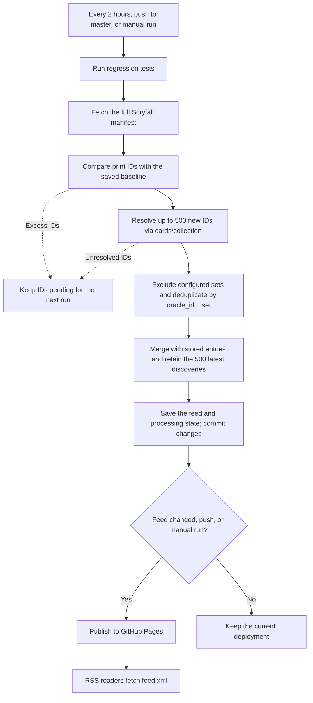

# MTG Spoiler RSS Feed

*[Deutsche Version](README.de.md)*

Automatically generated RSS feed for newly spoiled and released
Magic: The Gathering cards. Data comes from the [Scryfall API](https://scryfall.com/docs/api),
the build runs every 2 hours via GitHub Actions, and the result is published
on GitHub Pages.

## How new cards are detected

Instead of a rolling time window, each run fetches the complete Scryfall
card catalog via [`/cards/manifest`](https://scryfall.com/docs/api/cards/manifest)
(paginated, ~8 requests) and compares the set of all print IDs against the
last known state (`data/known_print_ids.json`). New IDs are then fully
resolved via [`/cards/collection`](https://scryfall.com/docs/api/cards/collection).
This is more robust than a date-based search, since nothing can get lost
due to an expired time window or preview-date quirks – a card print counts
as new as soon as its ID first appears in the catalog.

IDs that cannot be resolved are retried on subsequent runs. Each run processes
at most 500 new print IDs; larger backlogs are spread across runs so entries
are not discarded before appearing in the feed. On the initial run without a
baseline, only the first 500 prints in newest-release-first manifest order
are considered for the seed feed; the rest become the historical baseline.
Filtering and duplicate variants can make the initial feed smaller than 500.

Cards are tracked per `(oracle_id, set)` combination (`data/known_cards.json`):
a reprint in a new set creates a new feed entry, but multiple variants
(foil, showcase, …) within the same set only produce one.

Reprints are included, except for excluded sets such as `plst` (The List).
RSS GUIDs use the same `(oracle_id, set)` identity. Entries are ordered by a
persisted discovery timestamp, also used for RSS `pubDate`, rather than the
card's release date. The feed retains the 500 most recently discovered entries.
Readers still need to poll regularly: this is a bounded feed, not an archive.

Both Scryfall rate limits are respected: 10 requests/minute for
`/cards/manifest`, 2 requests/second for `/cards/collection`.

### Update workflow

After the initial bootstrap, each successful update follows this flow:



## Subscribing to the feed

After the first deployment, the feed is available at:

```
https://<your-username>.github.io/<repo-name>/feed.xml
```

Add this URL to any RSS reader (e.g. Feedly, NewsBlur, NetNewsWire,
Thunderbird, …).

## Setting up the repository

### 1. Create a repository

Create a new **public** GitHub repository (or fork this one).

### 2. Enable GitHub Pages

In the repository settings:

```
Settings → Pages → Source: GitHub Actions
```

### 3. Trigger the first run

```
Actions → "Update MTG Spoiler RSS Feed" → Run workflow
```

The first run populates the state files and generates `docs/feed.xml` if no
baseline exists. A fork containing state files continues from that snapshot.
After that, the workflow runs automatically every 2 hours.

State changes are committed even when no new feed entry is produced. Pushes to
`master` and manual runs deploy the site independently of new cards; scheduled
runs deploy only when the feed changes. The optional Boolean `force_commit`
requests the commit/push step even when the generator reports no changes; an
empty commit is not created. Regression tests run before each generation.

### 4. Determine the feed URL

```
https://<username>.github.io/<repo>/feed.xml
```

---

## Configuration

All parameters are defined as constants at the top of the
`scripts/generate_feed.py` script:

| Constant | Default | Description |
|---|---|---|
| `MAX_FEED_ENTRIES` | `500` | Maximum feed entries and new print IDs processed per run |
| `EXCLUDED_SET_CODES` | `{"plst"}` | Set codes whose cards never count as "new" (e.g. "The List") |

The optional environment variable `FEED_URL` sets the absolute RSS self URL.
GitHub Actions derives it from the Pages deployment URL, including custom
domains. A repository variable named `FEED_URL` can override it. When running
locally without this variable, the optional self link is omitted.

---

## Running locally

```bash
# Dependencies: none (Python 3.11+ stdlib only)
python scripts/generate_feed.py
```

The generated feed is then located at `docs/feed.xml`.

To rebuild or migrate the stored feed without contacting Scryfall:

```bash
python scripts/generate_feed.py --rebuild
```

Existing entries receive their saved discovery time from `known_cards.json`
(including legacy oracle-only keys). If no timestamp is available, the migration
time is stored once. Changing GUIDs to include the set may cause readers to show
existing entries once more. Cards already skipped by older versions are not
automatically replayed; the historical snapshot is preserved.

Writes use atomic file replacement. The feed and its items are saved before
advancing the known-card and print-ID state. Unchanged runs preserve file
contents and `lastBuildDate`. The website displays this actual feed build time,
or an unavailable status if the feed cannot be loaded.

## Tests

```bash
python -m unittest discover -s tests -v
```

Tests use temporary directories and mocked API responses. They do not change
the tracked feed or call Scryfall. Coverage includes retries of unresolved IDs,
bootstrap, backlogs, filtering, GUIDs, HTML escaping, discovery timestamps,
migration, unchanged runs, write failures, pagination and collection batching.

For a local browser preview (including the build-time request):

```bash
python -m http.server 8000 --bind 127.0.0.1 --directory docs
```

Open `http://127.0.0.1:8000/` or `http://127.0.0.1:8000/index.html`.

---

## File structure

```
.
├── .github/
│   └── workflows/
│       └── update-feed.yml     # GitHub Actions workflow
├── data/
│   ├── known_cards.json        # Known (oracle_id, set) combinations (duplicate protection)
│   ├── known_print_ids.json    # Baseline of all Scryfall print IDs (last manifest state)
│   └── feed_items.json         # Most recently rendered feed entries (base for the next build)
├── docs/                       # GitHub Pages root
│   ├── feed.xml                # Generated RSS feed
│   └── index.html              # Info page
├── scripts/
│   └── generate_feed.py        # Feed generator
├── tests/
│   └── test_generate_feed.py    # Offline regression tests
└── README.md
```

---

## Privacy & License

Card data and images are sourced from [Scryfall](https://scryfall.com) and
are the property of Wizards of the Coast LLC.
Magic: The Gathering is a registered trademark of Wizards of the Coast.

This project is licensed under the [MIT License](LICENSE).
